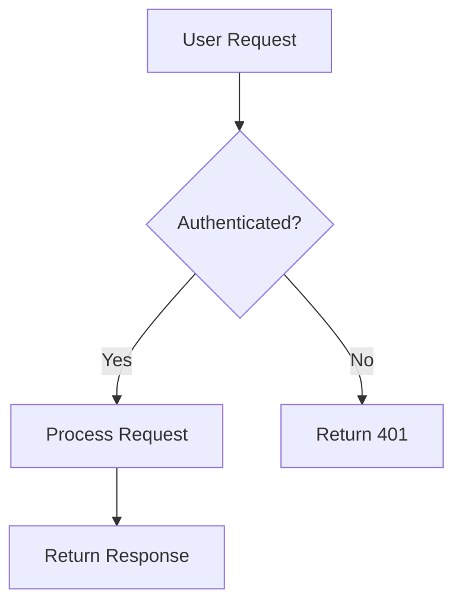

# 🤝 Guide de Contribution - Billetterie Project

Merci de votre intérêt pour contribuer à **Billetterie Project** ! Ce guide vous aidera à démarrer et à soumettre vos contributions efficacement.

---

## 📋 Table des matières

- [Code de Conduite](#code-de-conduite)
- [Comment Contribuer](#comment-contribuer)
- [Configuration du Développement](#configuration-du-développement)
- [Standards de Code](#standards-de-code)
- [Conventions de Commit](#conventions-de-commit)
- [Processus de Pull Request](#processus-de-pull-request)
- [Tests](#tests)
- [Documentation](#documentation)
- [Questions et Support](#questions-et-support)

---

## 📜 Code de Conduite

Ce projet adhère à un code de conduite pour assurer un environnement accueillant et respectueux pour tous.

### Nos Valeurs

- **Respect** : Traiter tout le monde avec respect
- **Collaboration** : Travailler ensemble de manière constructive
- **Inclusivité** : Accueillir toutes les contributions
- **Professionnalisme** : Maintenir un niveau de qualité élevé

### Comportements Attendus

✅ Utiliser un langage accueillant et inclusif  
✅ Respecter les points de vue différents  
✅ Accepter les critiques constructives  
✅ Se concentrer sur ce qui est meilleur pour la communauté  

### Comportements Non Acceptés

❌ Harcèlement sous toute forme  
❌ Langage ou imagerie inappropriée  
❌ Attaques personnelles  
❌ Trolling ou commentaires insultants  

---

## 💡 Comment Contribuer

Il existe plusieurs façons de contribuer au projet :

### 🐛 Signaler un Bug

1. Vérifier que le bug n'a pas déjà été signalé dans [Issues](https://github.com/CorentinCoulet/M-C-Billetterie/issues)
2. Créer une nouvelle issue avec le template "Bug Report"
3. Fournir :
   - Description claire du problème
   - Étapes pour reproduire
   - Comportement attendu vs réel
   - Captures d'écran si applicable
   - Environnement (OS, Node version, etc.)

### ✨ Proposer une Fonctionnalité

1. Vérifier que la fonctionnalité n'existe pas déjà
2. Créer une issue avec le template "Feature Request"
3. Décrire :
   - Problème à résoudre
   - Solution proposée
   - Alternatives considérées
   - Impact sur les utilisateurs

### 📝 Améliorer la Documentation

- Corriger les fautes de frappe
- Clarifier les explications
- Ajouter des exemples
- Traduire du contenu

### 💻 Contribuer au Code

- Corriger des bugs
- Implémenter des fonctionnalités
- Optimiser les performances
- Améliorer les tests

---

## 🚀 Configuration du Développement

### Prérequis

**Obligatoires :**
- **Node.js** : 18.0.0 ou supérieur
- **Yarn** : 1.22.0 ou supérieur (⚠️ **npm n'est pas supporté**)
- **PostgreSQL** : 14 ou supérieur
- **Redis** : 7 ou supérieur (optionnel en dev)
- **Docker & Docker Compose** : Dernière version

**Recommandés :**
- **VS Code** avec extensions :
  - ESLint
  - Prettier
  - Prisma
  - TypeScript
  - Docker

### Installation

```bash
# 1. Fork et cloner le repository
git clone https://github.com/VOTRE-USERNAME/M-C-Billetterie.git
cd M-C-Billetterie

# 2. Installer les dépendances (YARN UNIQUEMENT)
yarn install

# 3. Copier la configuration d'environnement
cp .env.example .env

# 4. Éditer .env avec vos paramètres locaux
# Variables minimales requises :
# - DATABASE_URL
# - JWT_SECRET
# - SESSION_SECRET
code .env

# 5. Initialiser la base de données
yarn db:migrate
yarn db:generate

# 6. (Optionnel) Seed avec des données de test
yarn db:seed

# 7. Démarrer le serveur de développement
yarn dev
```

L'application sera accessible sur **http://localhost:3000**

### Utiliser Docker pour le Développement

```bash
# Démarrer l'environnement complet (PostgreSQL + Redis + App)
yarn docker:dev

# Ou utiliser le script PowerShell
.\start-docker.ps1 dev -Up

# Voir les logs
docker-compose -f docker-compose.yml -f docker-compose.dev.yml logs -f

# Arrêter
yarn docker:down
```

### Outils de Développement Disponibles

```bash
# Démarrer tous les outils (Adminer, pgAdmin, Redis Commander, etc.)
.\scripts-tools.ps1

# Accès aux outils :
# - Adminer: http://localhost:8081
# - pgAdmin: http://localhost:8082
# - Redis Commander: http://localhost:8084
# - Mailhog: http://localhost:8025
# - Portainer: http://localhost:9000
```

---

## 📐 Standards de Code

### Style de Code

Le projet utilise **ESLint** et **Prettier** pour maintenir la cohérence du code.

```bash
# Vérifier le style
yarn lint

# Corriger automatiquement
yarn lint:fix

# Formater avec Prettier
yarn format
```

### Conventions TypeScript

```typescript
// ✅ BON
interface UserData {
  id: string;
  email: string;
  firstName: string;
  lastName: string;
}

function getUserById(userId: string): Promise<UserData> {
  // Implementation
}

// ❌ MAUVAIS
interface user_data {
  ID: string;
  Email: string;
}

function get_user(user_id: any) {
  // Implementation
}
```

### Règles Générales

**Nommage :**
- `camelCase` pour variables et fonctions
- `PascalCase` pour classes et interfaces
- `UPPER_SNAKE_CASE` pour constantes
- `kebab-case` pour fichiers

**Code :**
- **Indentation** : 2 espaces (pas de tabs)
- **Quotes** : Simple quotes `'` pour strings
- **Semicolons** : Oui (obligatoires)
- **Max line length** : 100 caractères
- **Arrow functions** : Préférées pour callbacks

**TypeScript :**
- Mode strict activé
- Pas de `any` (utiliser `unknown` si nécessaire)
- Types explicites pour exports publics
- Interfaces préférées aux types

### Structure des Fichiers

```typescript
// 1. Imports externes
import { NextRequest } from 'next/server';
import { z } from 'zod';

// 2. Imports internes
import { prisma } from '@/lib/prisma';
import { NextApiResponse } from '@/lib/api-response';

// 3. Types et interfaces
interface UserCreateInput {
  email: string;
  password: string;
}

// 4. Constants
const MAX_RETRIES = 3;

// 5. Fonctions principales
export async function createUser(data: UserCreateInput) {
  // Implementation
}

// 6. Fonctions helpers (non exportées)
function validateEmail(email: string): boolean {
  // Implementation
}
```

---

## 📝 Conventions de Commit

Nous suivons la convention **[Conventional Commits](https://www.conventionalcommits.org/)**.

### Format

```
<type>(<scope>): <description>

[corps optionnel]

[pied optionnel]
```

### Types

| Type | Description | Exemple |
|------|-------------|---------|
| `feat` | Nouvelle fonctionnalité | `feat(auth): add OAuth2 login` |
| `fix` | Correction de bug | `fix(qr): resolve rotation timing` |
| `docs` | Documentation uniquement | `docs(api): update endpoints list` |
| `style` | Formatage, pas de changement de code | `style: fix indentation` |
| `refactor` | Refactoring sans changement fonctionnel | `refactor(db): optimize queries` |
| `perf` | Amélioration de performance | `perf(api): add caching layer` |
| `test` | Ajout/modification de tests | `test(auth): add unit tests` |
| `chore` | Tâches de maintenance | `chore(deps): update dependencies` |
| `ci` | Configuration CI/CD | `ci: add GitHub Actions workflow` |
| `build` | Changements build/dépendances | `build: update webpack config` |
| `revert` | Annulation d'un commit | `revert: feat(auth): add OAuth2` |

### Scopes Courants

- `auth` - Authentification
- `api` - Routes API
- `db` - Base de données
- `ui` - Interface utilisateur
- `qr` - Système QR codes
- `email` - Système d'emails
- `payment` - Paiements Stripe
- `security` - Sécurité
- `docker` - Configuration Docker
- `docs` - Documentation

### Exemples

```bash
# Nouvelle fonctionnalité
feat(tickets): add PDF download functionality

# Correction de bug
fix(qr): prevent duplicate validation requests

# Documentation
docs(readme): add setup instructions

# Refactoring
refactor(api): migrate to Next.js API routes

# Tests
test(auth): add integration tests for JWT

# Performance
perf(cache): implement Redis caching layer

# Breaking change
feat(api)!: change authentication flow

BREAKING CHANGE: Authentication now requires refresh tokens
```

### Règles

- Utiliser l'impératif présent : "add" pas "added" ou "adds"
- Première lettre en minuscule
- Pas de point à la fin
- Description concise (< 72 caractères)
- Corps optionnel pour explications détaillées
- Footer pour breaking changes ou issues

---

## 🔀 Processus de Pull Request

### Avant de Soumettre

**Checklist :**

- [ ] Code respecte les standards du projet
- [ ] Tous les tests passent (`yarn test:all`)
- [ ] Pas de warnings TypeScript (`yarn type-check`)
- [ ] Lint passé (`yarn lint`)
- [ ] Documentation mise à jour si nécessaire
- [ ] Commits suivent la convention
- [ ] Branch à jour avec `main`

### Créer une Pull Request

1. **Créer une branche depuis main**
   ```bash
   git checkout main
   git pull origin main
   git checkout -b feat/ma-super-feature
   ```

2. **Développer et tester**
   ```bash
   # Développer votre fonctionnalité
   # Tester régulièrement
   yarn test:watch
   ```

3. **Commit avec la convention**
   ```bash
   git add .
   git commit -m "feat(scope): description claire"
   ```

4. **Push vers votre fork**
   ```bash
   git push origin feat/ma-super-feature
   ```

5. **Créer la PR sur GitHub**
   - Aller sur GitHub
   - Cliquer sur "Compare & pull request"
   - Remplir le template de PR

### Template de Pull Request

```markdown
## 📝 Description

Décrivez clairement ce que fait cette PR.

Fixes #(numéro d'issue)

## 🔄 Type de changement

- [ ] 🐛 Bug fix (changement non-breaking qui corrige un problème)
- [ ] ✨ Nouvelle fonctionnalité (changement non-breaking qui ajoute une fonctionnalité)
- [ ] 💥 Breaking change (correction ou fonctionnalité qui casserait la compatibilité)
- [ ] 📝 Documentation (changements de documentation uniquement)
- [ ] 🎨 Style (formatage, sans changement de code)
- [ ] ♻️ Refactoring (changement de code sans ajout de fonctionnalité ni correction)
- [ ] ⚡ Performance (amélioration de performance)
- [ ] ✅ Tests (ajout ou correction de tests)

## 🧪 Tests

Décrivez les tests que vous avez effectués :

- [ ] Tests unitaires
- [ ] Tests d'intégration
- [ ] Tests E2E
- [ ] Tests manuels

## 📸 Screenshots (si applicable)

Ajoutez des captures d'écran pour les changements UI.

## ✅ Checklist

- [ ] Mon code respecte les standards du projet
- [ ] J'ai effectué une auto-review de mon code
- [ ] J'ai commenté les parties complexes
- [ ] J'ai mis à jour la documentation
- [ ] Mes changements ne génèrent pas de warnings
- [ ] J'ai ajouté des tests qui prouvent que ma correction/fonctionnalité fonctionne
- [ ] Les tests unitaires passent en local
- [ ] Les tests E2E passent en local
```

### Review Process

1. **Review automatique**
   - CI/CD lance automatiquement
   - Vérification des tests
   - Analyse de code
   - Vérification de sécurité

2. **Review humaine**
   - Au moins 1 approbation requise
   - Discussion sur le code
   - Suggestions d'amélioration

3. **Modifications demandées**
   ```bash
   # Faire les modifications
   git add .
   git commit -m "fix: address review comments"
   git push origin feat/ma-super-feature
   ```

4. **Merge**
   - Squash and merge (recommandé)
   - Supprimer la branche après merge

---

## 🧪 Tests

Les tests sont **obligatoires** pour toute contribution de code.

### Lancer les Tests

```bash
# Tous les tests (Jest + Playwright)
yarn test:all

# Tests Jest uniquement
yarn test

# Tests en mode watch
yarn test:watch

# Tests avec coverage
yarn test:coverage

# Tests E2E
yarn test:e2e

# Tests E2E avec UI
yarn test:e2e:ui

# Tests de mutation
yarn test:mutation

# Tests de performance
yarn perf:all
```

### Écrire des Tests

**Structure d'un test :**

```typescript
// __tests__/services/user.test.ts
import { createUser, getUserById } from '@/services/user';
import { prisma } from '@/lib/prisma';

describe('User Service', () => {
  beforeEach(() => {
    // Setup avant chaque test
  });

  afterEach(() => {
    // Cleanup après chaque test
  });

  describe('createUser', () => {
    it('should create a new user with valid data', async () => {
      // Arrange
      const userData = {
        email: 'test@example.com',
        password: 'SecurePass123!',
        firstName: 'John',
        lastName: 'Doe',
      };

      // Act
      const user = await createUser(userData);

      // Assert
      expect(user).toBeDefined();
      expect(user.email).toBe(userData.email);
      expect(user.password).not.toBe(userData.password); // hashed
    });

    it('should throw error with invalid email', async () => {
      // Arrange
      const userData = {
        email: 'invalid-email',
        password: 'SecurePass123!',
      };

      // Act & Assert
      await expect(createUser(userData)).rejects.toThrow('Invalid email');
    });
  });
});
```

### Coverage Minimale

- **Global** : 80%
- **Branches** : 75%
- **Fonctions** : 80%
- **Lignes** : 80%

---

## 📚 Documentation

Toute contribution de code doit inclure la documentation appropriée.

### Documentation du Code

```typescript
/**
 * Creates a new user in the database
 * 
 * @param data - User creation data
 * @param data.email - User's email address (must be unique)
 * @param data.password - User's password (will be hashed)
 * @param data.firstName - User's first name
 * @param data.lastName - User's last name
 * 
 * @returns Promise resolving to the created user (without password)
 * 
 * @throws {ValidationError} If the input data is invalid
 * @throws {ConflictError} If a user with the email already exists
 * 
 * @example
 * ```typescript
 * const user = await createUser({
 *   email: 'john@example.com',
 *   password: 'SecurePass123!',
 *   firstName: 'John',
 *   lastName: 'Doe'
 * });
 * ```
 */
export async function createUser(data: UserCreateInput): Promise<User> {
  // Implementation
}
```

### Documentation Markdown

Lors de l'ajout de nouvelles fonctionnalités, mettre à jour :

- `README.md` - Si impact sur l'utilisation générale
- `docs/*.md` - Documentation technique détaillée
- `CHANGELOG.md` - Ajouter dans la section [Unreleased]
- API docs - Si nouveaux endpoints

### Diagrammes

Utiliser **Mermaid** pour les diagrammes :

```markdown

```

---

## ❓ Questions et Support

### Avant de Poser une Question

1. Consulter la [documentation](./docs/README.md)
2. Chercher dans les [issues existantes](https://github.com/CorentinCoulet/M-C-Billetterie/issues)
3. Vérifier les [discussions](https://github.com/CorentinCoulet/M-C-Billetterie/discussions)

### Où Poser une Question

- **Questions générales** : [GitHub Discussions](https://github.com/CorentinCoulet/M-C-Billetterie/discussions)
- **Bugs** : [GitHub Issues](https://github.com/CorentinCoulet/M-C-Billetterie/issues)
- **Sécurité** : Voir [SECURITY.md](./SECURITY.md)

### Communauté

- **Discord** : [Rejoindre le serveur](https://discord.gg/billetterie) *(si disponible)*
- **Twitter** : [@BilletterieApp](https://twitter.com/billetterie) *(si disponible)*

---

## 🎓 Ressources pour Débuter

### Apprendre les Technologies

- [Next.js Documentation](https://nextjs.org/docs)
- [TypeScript Handbook](https://www.typescriptlang.org/docs/)
- [Prisma Guides](https://www.prisma.io/docs/)
- [Jest Documentation](https://jestjs.io/docs/getting-started)
- [Playwright Docs](https://playwright.dev/)

### Bonnes Pratiques

- [Clean Code JavaScript](https://github.com/ryanmcdermott/clean-code-javascript)
- [TypeScript Best Practices](https://www.typescriptlang.org/docs/handbook/declaration-files/do-s-and-don-ts.html)
- [Testing Best Practices](https://github.com/goldbergyoni/javascript-testing-best-practices)

---

## 🙏 Remerciements

Merci à tous les contributeurs qui font vivre ce projet !

### Hall of Fame

<!-- Liste automatique des contributeurs GitHub -->

---

## 📄 Licence

En contribuant à ce projet, vous acceptez que vos contributions soient licenciées sous la même licence que le projet (MIT License).

---

**Dernière mise à jour** : 11 Octobre 2025  
**Questions ?** Ouvrez une [discussion GitHub](https://github.com/CorentinCoulet/M-C-Billetterie/discussions)

Merci de contribuer à **Billetterie Project** ! 🎉
