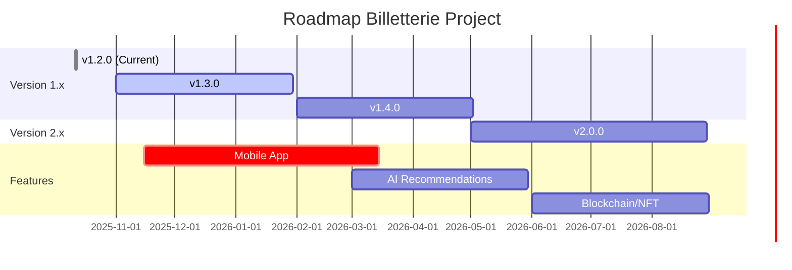

# 🗺️ Roadmap - Billetterie Project

Feuille de route du développement de la plateforme Billetterie. Cette roadmap est un document vivant et peut évoluer en fonction des priorités et des retours utilisateurs.

---

## 📅 Vue d'Ensemble

---

## ✅ Version 1.2.0 - Actuelle (Octobre 2025)

**Status** : ✅ Déployée en production

### Principales Fonctionnalités

- ✅ Système de QR codes sécurisés avec rotation automatique
- ✅ Templates d'emails professionnels (7 types)
- ✅ Infrastructure de monitoring complète (Prometheus + Grafana)
- ✅ Rate limiting distribué avec Redis
- ✅ Gestion des secrets multi-provider
- ✅ Documentation complète (15+ documents)
- ✅ Suite de tests exhaustive (1277+ tests)
- ✅ Conformité GDPR documentée

**Détails complets** : [CHANGELOG.md](./CHANGELOG.md)

---

## 🚀 Version 1.3.0 - Communication Temps Réel (Q4 2025 - Q1 2026)

**Date de sortie prévue** : Janvier 2026  
**Status** : 🔄 En développement

### Objectifs Principaux

Améliorer l'engagement utilisateur avec des communications instantanées et une expérience mobile native.

### 📱 Application Mobile React Native

**Priorité** : 🔴 Critique

#### iOS & Android
- [ ] Architecture React Native avec Expo
- [ ] Navigation optimisée (React Navigation)
- [ ] State management (Redux Toolkit)
- [ ] Design system cohérent avec le web

#### Fonctionnalités
- [ ] **Authentification mobile**
  - Biométrie (Touch ID / Face ID)
  - Stockage sécurisé des credentials
  - Synchronisation avec le compte web
- [ ] **Scanner QR codes intégré**
  - Caméra native optimisée
  - Validation offline avec cache
  - Feedback visuel immédiat
- [ ] **Portefeuille de billets**
  - Liste des billets actifs
  - Vue détaillée par billet
  - Téléchargement PDF
  - Partage de billets
- [ ] **Notifications push**
  - Rappels d'événements
  - Statut de commande
  - Offres personnalisées

**Technologies** :
- React Native 0.73+
- Expo SDK 50+
- React Navigation 6
- Redux Toolkit
- Axios + React Query

### 🔔 Notifications Push

**Priorité** : 🔴 Critique

- [ ] **WebSockets pour temps réel**
  - Socket.IO ou Pusher
  - Reconnexion automatique
  - Gestion des salles par événement
- [ ] **Service Worker pour PWA**
  - Push API native
  - Background sync
  - Notifications offline
- [ ] **Préférences utilisateur**
  - Centre de notification dans le dashboard
  - Granularité fine (par type)
  - Fréquence configurable

**Types de Notifications** :
- Confirmation de commande
- Rappel d'événement (24h, 1h)
- Changement d'événement
- Offres spéciales
- Nouveaux événements suivis

### 🌍 Système Multi-langue (i18n)

**Priorité** : 🟠 Important

- [ ] **Langues supportées**
  - 🇫🇷 Français (par défaut)
  - 🇬🇧 Anglais
  - 🇪🇸 Espagnol
  - 🇩🇪 Allemand
- [ ] **Infrastructure**
  - next-i18next ou next-intl
  - Détection automatique de langue
  - Sélecteur de langue
  - URLs localisées (/fr/events, /en/events)
- [ ] **Contenu traduit**
  - Interface complète
  - Templates d'emails
  - Notifications
  - Documentation utilisateur
- [ ] **CMS pour traductions**
  - Interface admin
  - Traduction collaborative
  - Versioning des traductions

### 📊 Dashboard Analytics Avancés

**Priorité** : 🟡 Moyen

- [ ] **Pour organisateurs**
  - Statistiques détaillées par événement
  - Taux de conversion
  - Origine des ventes
  - Revenus en temps réel
- [ ] **Visualisations**
  - Graphiques interactifs (Chart.js)
  - Exports personnalisés
  - Rapports automatisés

### ⚡ Améliorations Performance

**Priorité** : 🟡 Moyen

- [ ] **Optimisations frontend**
  - Lazy loading avancé
  - Code splitting optimisé
  - Image optimization (WebP, AVIF)
- [ ] **Optimisations backend**
  - Query optimization
  - Database indexing
  - Connection pooling
- [ ] **CDN global**
  - Cloudflare ou AWS CloudFront
  - Cache edge locations
  - Geo-routing

---

## 🎯 Version 1.4.0 - Intelligence & Engagement (Q2 2026)

**Date de sortie prévue** : Avril 2026  
**Status** : 📋 Planifié

### 🤖 Recommandations par IA

**Priorité** : 🔴 Critique

#### Machine Learning
- [ ] **Système de recommandation**
  - Analyse des préférences utilisateur
  - Collaborative filtering
  - Content-based filtering
  - Hybrid approach
- [ ] **Modèle d'entraînement**
  - Historique d'achats
  - Événements consultés
  - Interactions (likes, partages)
  - Données démographiques

#### Features
- [ ] **Suggestions personnalisées**
  - "Événements pour vous"
  - "Événements similaires"
  - "Les utilisateurs comme vous ont aimé"
- [ ] **Notifications intelligentes**
  - Alertes sur événements pertinents
  - Prédiction de disponibilité
  - Offres dynamiques

**Technologies** :
- TensorFlow.js ou Python backend
- Redis pour cache des recommandations
- PostgreSQL pour training data
- APIs ML (OpenAI, Anthropic)

### 🎁 Programme de Fidélité

**Priorité** : 🟠 Important

#### Points & Récompenses
- [ ] **Système de points**
  - Points par achat (1€ = 10 points)
  - Bonus événements spéciaux
  - Points d'anniversaire
- [ ] **Niveaux VIP**
  - Bronze (0-999 points)
  - Argent (1000-4999 points)
  - Or (5000-9999 points)
  - Platine (10000+ points)
- [ ] **Avantages par niveau**
  - Réductions progressives
  - Accès prioritaire
  - Billets exclusifs
  - Support dédié

#### Gamification
- [ ] Badges d'accomplissement
- [ ] Défis mensuels
- [ ] Classements
- [ ] Partage sur réseaux sociaux

### 📈 Analytics Avancés & BI

**Priorité** : 🟡 Moyen

- [ ] **Business Intelligence**
  - Tableaux de bord personnalisables
  - KPIs en temps réel
  - Prédictions de ventes
  - Analyse de tendances
- [ ] **Tracking comportemental**
  - Heatmaps (Hotjar)
  - Session recordings
  - Funnel analysis
  - A/B testing framework

### 💬 Système de Chat Support

**Priorité** : 🟡 Moyen

- [ ] **Chat en direct**
  - Widget intégré
  - Réponses automatiques (chatbot)
  - Escalade vers humain
- [ ] **Base de connaissance**
  - FAQ interactive
  - Articles d'aide
  - Recherche intelligente

---

## 🚀 Version 2.0.0 - Plateforme Next-Gen (Q3 2026)

**Date de sortie prévue** : Septembre 2026  
**Status** : 💭 Vision

### Architecture Microservices

**Priorité** : 🔴 Critique

- [ ] **Migration vers microservices**
  - Service Events
  - Service Users
  - Service Orders
  - Service Payments
  - Service Notifications
- [ ] **API Gateway**
  - Kong ou AWS API Gateway
  - Rate limiting centralisé
  - Authentication/Authorization
- [ ] **Service Mesh**
  - Istio ou Linkerd
  - Observabilité avancée
  - Circuit breakers

### 🏪 Marketplace d'Événements

**Priorité** : 🟠 Important

- [ ] **Organisateurs vérifiés**
  - Système de badge
  - Reviews et ratings
  - Certifications
- [ ] **Recherche avancée**
  - Filtres multicritères
  - Géolocalisation
  - Disponibilité en temps réel
- [ ] **Comparaison de prix**
  - Prix dynamiques
  - Alertes de baisse
  - Historical pricing

### 📺 Streaming d'Événements Live

**Priorité** : 🟡 Moyen

- [ ] **Infrastructure streaming**
  - WebRTC ou HLS
  - CDN adaptatif
  - Multi-bitrate
- [ ] **Features interactives**
  - Chat en direct
  - Réactions en temps réel
  - Q&A avec intervenants
- [ ] **Monétisation**
  - Billets virtuels
  - Pay-per-view
  - Replays à la demande

### 🎨 NFT & Blockchain

**Priorité** : 🟢 Basse (Exploratory)

- [ ] **Billets NFT**
  - Smart contracts (Ethereum/Polygon)
  - Wallets intégrés (MetaMask)
  - Marketplace de revente
- [ ] **Collectibles**
  - Billets édition limitée
  - Souvenirs digitaux
  - Authenticité blockchain
- [ ] **Royalties automatiques**
  - Revenu pour organisateurs
  - Commission sur reventes

### 🥽 Réalité Augmentée (AR)

**Priorité** : 🟢 Basse (Exploratory)

- [ ] **Prévisualisation salles**
  - Vue de siège en AR
  - Visite virtuelle 360°
  - Placement optimal
- [ ] **Expériences immersives**
  - Filtres AR pour événements
  - Photos souvenirs
  - Easter eggs cachés

---

## 🔄 Améliorations Continues

Ces améliorations seront intégrées progressivement dans toutes les versions :

### 🔒 Sécurité

- [ ] Audits de sécurité trimestriels
- [ ] Penetration testing annuel
- [ ] Bug bounty program
- [ ] Zero-trust architecture
- [ ] Multi-factor authentication (MFA)

### ⚡ Performance

- [ ] Lighthouse score >90
- [ ] Core Web Vitals optimisés
- [ ] Database query optimization
- [ ] Caching strategies avancées
- [ ] Load testing régulier

### 🧪 Qualité

- [ ] Couverture de tests >90%
- [ ] Mutation testing score >80%
- [ ] Code review automatisé
- [ ] Static analysis (SonarQube)
- [ ] Dependency updates automatiques

### 📚 Documentation

- [ ] Documentation API toujours à jour
- [ ] Guides interactifs
- [ ] Vidéos tutoriels
- [ ] Webinaires pour organisateurs
- [ ] Blog technique

---

## 📊 Métriques de Succès

### KPIs par Version

| Version | Utilisateurs | Événements | Billets/mois | Uptime |
|---------|--------------|------------|--------------|--------|
| 1.2.0   | 1,000        | 50         | 5,000        | 99.5%  |
| 1.3.0   | 5,000        | 200        | 20,000       | 99.9%  |
| 1.4.0   | 20,000       | 1,000      | 100,000      | 99.9%  |
| 2.0.0   | 100,000      | 5,000      | 500,000      | 99.99% |

### Objectifs Techniques

| Métrique | v1.2.0 | v1.3.0 | v1.4.0 | v2.0.0 |
|----------|--------|--------|--------|--------|
| Page Load | <2s | <1.5s | <1s | <500ms |
| API Response | <200ms | <150ms | <100ms | <50ms |
| Test Coverage | 80% | 85% | 90% | 95% |
| Lighthouse Score | 85 | 90 | 95 | 100 |

---

## 🗳️ Feedback & Priorisation

### Comment Influencer la Roadmap

Vos retours comptent ! Plusieurs façons de participer :

1. **GitHub Discussions**
   - Proposer des fonctionnalités
   - Voter pour vos préférées
   - Commenter les propositions

2. **GitHub Issues**
   - Signaler des bugs
   - Demander des améliorations
   - Labels "enhancement" et "feature request"

3. **Sondages Utilisateurs**
   - Sondages trimestriels
   - Beta testing
   - User interviews

4. **Communauté**
   - Discord (si disponible)
   - Twitter feedback
   - Email: feedback@billetterie.com

### Critères de Priorisation

Nous utilisons le framework **RICE** :

- **Reach** : Nombre d'utilisateurs impactés
- **Impact** : Bénéfice pour les utilisateurs (0.25 à 3)
- **Confidence** : Certitude de l'estimation (%)
- **Effort** : Temps de développement (en mois)

**Score RICE** = (Reach × Impact × Confidence) / Effort

---

## 🚧 Features en Considération

Ces fonctionnalités sont envisagées mais pas encore planifiées :

- **Intégrations tierces** : Eventbrite, Meetup, Facebook Events
- **API publique** pour développeurs tiers
- **Webhooks** pour intégrations custom
- **Abonnements** pour organisateurs récurrents
- **Programme d'affiliation** pour promoteurs
- **Système de coupons** avancé
- **Cartes cadeaux** numériques
- **Billets groupés** (packages)
- **Upgrade/downgrade** de billets
- **Liste d'attente** automatique
- **Vente flash** chronométrée

**💡 Proposez vos idées !** → [GitHub Discussions](https://github.com/CorentinCoulet/M-C-Billetterie/discussions)

---

## 📅 Calendrier des Releases

### Release Cadence

- **Versions majeures** (x.0.0) : ~6 mois
- **Versions mineures** (x.x.0) : ~2 mois
- **Patches de sécurité** : Immédiat
- **Patches bugs** : ~2 semaines

### Prochaines Dates Clés

| Date | Event | Description |
|------|-------|-------------|
| Nov 2025 | v1.3.0 Beta | Mobile app beta testing |
| Déc 2025 | v1.3.0 RC | Release candidate |
| Jan 2026 | v1.3.0 Release | Production deployment |
| Fév 2026 | v1.4.0 Planning | Roadmap review |
| Avr 2026 | v1.4.0 Release | AI features |
| Sep 2026 | v2.0.0 Release | Microservices architecture |

---

## 🤝 Contribution à la Roadmap

Vous souhaitez contribuer au développement ?

### Développeurs

- Consulter [CONTRIBUTING.md](./CONTRIBUTING.md)
- Choisir une issue "good first issue"
- Proposer une PR

### Utilisateurs & Testeurs

- Participer aux betas
- Donner du feedback
- Signaler des bugs

### Organisateurs d'Événements

- Partager vos besoins
- Tester les nouvelles features
- Cas d'usage spécifiques

---

## 📞 Contact

Pour toute question sur la roadmap :

- **Email** : roadmap@billetterie.com
- **GitHub Discussions** : [Roadmap Category](https://github.com/CorentinCoulet/M-C-Billetterie/discussions/categories/roadmap)
- **Twitter** : [@BilletterieApp](https://twitter.com/billetterie)

---

**Dernière mise à jour** : 11 Octobre 2025  
**Prochaine révision** : Janvier 2026  
**Version du document** : 1.0

---

**🎉 Merci de faire partie de l'aventure Billetterie !**

Cette roadmap évolue avec vos retours. Ensemble, construisons la meilleure plateforme de billetterie ! 🚀
